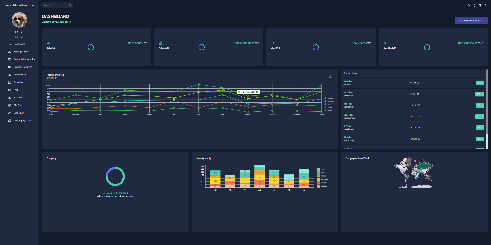

1.Demo image

2.Technology:
React/Mui/Formic/yup/React-Pro-Sidebar/fullcalendar/axios
3.Start server:
yarn start

Day 1:
1.Create App
yarn create react-app . --template typescript

2.Install dependencies
yarn add @mui/material @emotion/react @emotion/styled @mui/x-data-grid @mui/icons-material react-router-dom react-pro-sidebar formik yup @nivo/core @nivo/line @nivo/bar @nivo/geo axios
yarn add @fullcalendar/react @fullcalendar/core @fullcalendar/daygrid @fullcalendar/interaction @fullcalendar/list @fullcalendar/timegrid

3.Create folders, import fonts (index.css)

Day 2:
SideBar component

Key Point:
1.Can't put <Link/> component between <MenuItem></MenuItem>, for instance:<MenuItem><Link/></MenuItem>, this will cause "Warning: validateDOMNesting(…): <a> cannot appear as a descendant of <a>" error. The solution is <MenuItem component={<Link to={to} />}></MenuItem>

Day 3:
Tables:
Team/Invocies/Contacts:

Day 4:
Calendar/FAQ/BarChart/PieChart/LineChart/GeographyChart
Charts:
https://nivo.rocks/

Key point:
In the GeographyChart component, the data is too large, so the rendering process will probably execute first before getting data from data file or data source, and this will cause some undefined exception.

Solution: Use a state. Only rendering the page after getting data.

Day 5:
Dashboard
